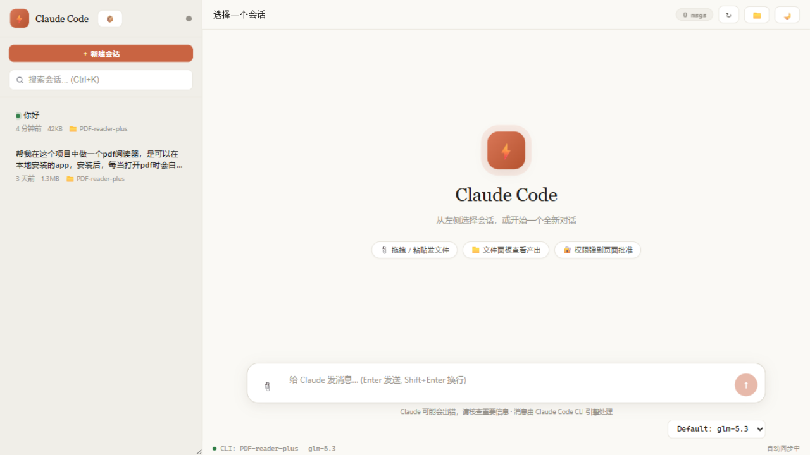

# Claude Code WebUI — 桌面聊天端

<p align="center">
  
</p>

把 Claude Code 变成一个**桌面聊天应用**：左侧会话列表一点切换、打字机式流式回复、📎 拖拽发文件、📁 面板收文件、浏览器里批准权限——底下的引擎还是你熟悉的 Claude Code CLI，能力一分不少。

灵感来自 Hermes Agent（CLI agent → 桌面 App 的同一条路）。

## 功能

- **流式对话** — 页面发消息由 `claude -p --output-format stream-json` 无头驱动：回复逐字出现（打字机 + 光标闪烁），工具调用实时显示（`⚙ Read …` → `✓`），可随时点"■ 停止"中断
- **会话切换** — 左侧列表列出所有历史会话（跨项目），搜索（Ctrl+K）、一点切换、正在回复的会话带 ● 标记
- **新建会话** — ＋新建会话 → 从"最近项目"下拉选目录（也可手输），不用碰终端
- **发文件** — 📎 按钮、拖拽到窗口任意位置、直接粘贴截图；文件存到 `~/.claude/webui-uploads/` 并在消息中引用
- **收文件** — 📁 文件面板自动列出 Claude 在本会话中创建/修改过的文件，一键下载或复制路径
- **权限审批** — 终端里跑的 Claude 需要权限时（Bash/编辑文件等），审批条实时弹到页面，允许/拒绝一键决定；页面自己发起的会话同样适用
- **实时同步** — 你在终端里正常使用 claude 时，每条消息/回复通过 hooks 实时推送到页面
- **桌面 App** — Edge/Chrome `--app` 独立窗口（无地址栏、可固定任务栏），开始菜单 + 桌面快捷方式，开机自启直接弹窗口
- **模型切换 / 深浅主题** — 顶栏切换 `ANTHROPIC_MODEL` 与浅色/深色主题（记忆选择）

## 快速开始

```bash
# 1. 安装依赖（一次性）
pip install -r requirements.txt python-multipart pywinpty

# 2. 启动服务 + 桌面窗口
python app.py --open-app
#   或双击 launch.bat

# 3. 桌面集成（推荐，一次性）
python install_app.py        # 开始菜单 + 桌面快捷方式
python install_hooks.py      # 终端 claude 会话接入页面（服务器首次启动会自动装）
python install_autostart.py  # 开机自启：服务 + 桌面窗口
```

之后从开始菜单/桌面点 **Claude Code WebUI** 即可使用；在终端里 `claude` 照常用，对话与权限自动同步到 App（服务静默启动，不会弹出浏览器页面；如需恢复自动弹页，在 `webui.config.json` 设 `"autoOpenBrowser": true`）。

### 卸载集成

```bash
python install_app.py --uninstall
python install_hooks.py --uninstall
python install_autostart.py --uninstall
```

## 使用方式

1. 打开桌面窗口（或 http://127.0.0.1:9020）
2. 点 **＋新建会话** → 选目录 → 输入第一条消息 → 看着回复逐字流出
3. 点左侧任意历史会话继续聊；Ctrl+K 搜索
4. 拖文件进窗口发给 Claude；点 **📁 文件** 查看它写的文件
5. 终端里的 claude 照常可用：页面实时镜像对话、权限弹到页面批准

### 已知限制

- 浏览器/页面发起的每条消息是一次独立的 `claude -p` 进程（约 1-3 秒启动开销），没有终端 TUI 的斜杠命令
- 终端里正在运行的交互会话：页面能看到对话与权限请求，但往它"插话"是追加到同一会话文件（该终端进程重启后才可见）

## 架构

```
桌面窗口 (Edge --app)  ←HTTP/WS→  FastAPI (app.py)
    │                              ├─ /api/chat        流式引擎 (claude -p stream-json)
    │  发文件 → ~/.claude/webui-uploads             ├─ /api/sessions    会话与消息 (JSONL tail)
    │  权限审批 ←──────────────────┤  hooks: PermissionRequest / SessionStart /
    │                              │          UserPromptSubmit / Stop / Notification
    └── 📁 文件面板 ← /api/sessions/{id}/files        └─ install_autostart / install_app / install_hooks
                                       hook_client.py (由 Claude Code 回调，可冷启动服务)
```

## 端点一览

| 端点 | 说明 |
|------|------|
| `POST /api/chat` | 发消息（stream-json 流式引擎，支持新会话 + cwd） |
| `GET /api/chat/{job}?since=n` | 拉取流式事件 |
| `POST /api/chat/{job}/stop` | 中断回复 |
| `GET /api/sessions` / `GET /api/sessions/{id}` | 会话列表 / 对话尾部 |
| `GET /api/sessions/{id}/files` | 本会话 Claude 写过的文件 |
| `GET /api/file/download` | 下载会话/上传目录内的文件 |
| `POST /api/upload` | 发送附件 |
| `GET /api/projects` | 最近项目目录 |
| `GET /api/permissions/pending` · `POST /api/permissions/{id}/decide` | 权限审批 |
| `POST /api/hook/{event}` | Claude Code hooks 接入 |
| `WS /ws` | 实时事件推送 |

## 文件

```
claude-code-desktop/
├── app.py              # FastAPI 后端（聊天引擎 / 会话 / 权限 / hooks）
├── uploads_api.py      # 附件上传（~/.claude/webui-uploads/）
├── hook_client.py      # Claude Code hooks 回调入口（可冷启动服务）
├── install_hooks.py    # hooks 安装器
├── install_autostart.py# 开机自启（服务 + 桌面窗口）
├── install_app.py      # 开始菜单/桌面快捷方式
├── static/index.html   # 界面（浅色默认，可切深色）
├── launch.bat          # 一键启动
└── requirements.txt
```

## License

MIT
